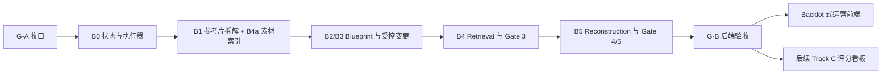

# 参考视频复刻 Skill：后端优先升级与进度看板技术设计

> **文档状态：已确认的设计基线，Track B 尚未实现**  
> **编写日期：2026-08-15**  
> 本文由 `docs/superpowers/specs/2026-08-15-remix-production-backend-design.md` 细化而来；不代表 Track B 已实现，也不改变当前任务的 Gate 状态。

当前替代 pilot `work/2026-08-15-tablemat-ga-replacement-pilot/` 已通过 Gate 5，但 G-A 仍未通过。Track B 继续 `locked_until_g_a`。G-A 通过前只允许设计、计划、隔离测试和锁护栏；真实执行器、生产缓存和普通 V2 任务必须等待 owner 记录的干净 G-A 通过。

实施入口：[生产后端设计规格](superpowers/specs/2026-08-15-remix-production-backend-design.md) · [实施计划](superpowers/plans/2026-08-15-remix-production-backend.md)

## 1. 目标与结论

目标是在不降低参考视频复刻质量和人工 Gate 可靠性的前提下，先把生产后端做成可缓存、可续跑、可审计的确定性执行器，再提供一线运营能看懂的实时进度界面。

本稿确定以下顺序：

1. 先完成 G-A 收口并解锁 Track B。
2. 先实现 Track B 后端、状态契约、事件流和 FastAPI/SSE 读取接口。
3. 用完整冷启动/热缓存案例通过 G-B，冻结后端契约。
4. 再实现 Backlot 式只读运营前端。
5. Track C 质量评分与成熟度看板继续后置，不与执行进度混为一谈。



## 2. 当前基线

### 2.1 真实任务状态

`work/2026-08-13-tablemat-pilot/` 的实际 `pipeline_state.json` 当前为：

- Gate 1、Gate 2、Gate 3 两个子状态、Gate 4 生成前/生成后均为 `approved`；
- 当前阶段为 `final_review`，Gate 5 为 `awaiting_user`；
- 最终预览和技术校验产物已经存在，但尚未完成最终业务审核；
- `manual_forward_log.json` 尚未补齐 Gate 4 顺序、配音后是否返工及完整效率字段；
- manifest 仍将 Track B 标记为 `locked_until_g_a`。

因此，Track B 的第一步是完成 G-A 证据收口，不是重做已有 pilot，也不把 pilot 产物当作新执行器的正向 golden fixture。

### 2.2 可复用与不可复用范围

可复用：V1 的 `ffprobe`、SHA-256、抽帧、场景切分、素材资格门禁、感知去重、全局排程、TTS 客户端、PCM 实测、累计帧时间轴、FFmpeg 校验和 staging 提升。

不可直接复用：固定片段数、固定产品词、固定路径和哈希、Gate 3 前直接物化素材、把精确裁点写回宽范围计划、尾帧冻结、后处理脚本静默删段或重排。

## 3. 范围边界

### 3.1 本阶段包含

- 统一 Python 运行时、CLI、依赖锁和完整 artifact schema；
- 状态事务、输入指纹、缓存、增量 stale、事件审计和崩溃恢复；
- 参考片拆解、素材索引、两遍 Blueprint、受控变更、Retrieval、Reconstruction；
- FastAPI JSON 读取接口和 SSE 变化通知；
- G-B 冷/热缓存配对验收。

### 3.2 本阶段不包含

- Track C 完整质量评分和成熟度看板；
- 通过网页直接批准 Gate；
- V1 历史任务原地迁移；
- 复用 OpenMontage 的 AGPL 代码、CSS、JS、阶段名或 DTO；
- 多租户、远程部署、权限系统和任务调度平台。

## 4. 总体架构

```text
一线运营（G-B 后）
        ↓
Backlot 式只读前端
        ↓  HTTP JSON / SSE
FastAPI 读取层（B0 先实现，前端后接入）
        ↓
ProgressView 投影器
        ↓
pipeline_state.json（唯一审批权威）
pipeline_events.jsonl（有序活动与审计事件）
stage_metrics.jsonl（完成后的性能投影）
        ↓
确定性阶段执行器与缓存
        ↓
recipe / blueprint / matching / voice / render artifacts
```

FastAPI 不维护第二份任务状态。SSE 只通知快照已变化，浏览器收到通知后重新读取权威快照。

### 4.1 三层命名空间

后端必须分开以下概念：

- `framework_stage_id`：固定五阶段：`performance_proven_video`、`blueprint`、`controlled_mutation`、`retrieval`、`reconstruction`；
- `execution_stage_id`：可并行或细分的机器步骤，例如 `probe-reference`、`index-assets`、`match-assets`、`build-timeline`；
- `gate_id/substate_id`：人工审批状态，例如 `gate3_material_selection`、`gate4_post_generation`。

`current_stage` 只能作为兼容投影，不能让前端猜测当前处于哪一个命名空间。

## 5. 后端权威契约

### 5.1 版本与兼容

- 当前 alpha.1 pilot 保持 `skill_version=2.0.0-alpha.1`、`contract_version=2.0.0-alpha.1`、`schema_version=1.0.0`，只读保存；
- 新执行器任务暂定使用 `2.0.0-alpha.2` 和完整 artifact schema `1.1.0`；
- G-B 通过后才晋级 `2.0.0-rc.1`；
- V1 的 `schema_version=1.0` 和历史审批不回写、不伪造迁移；
- 所有新产物继续携带 `artifact_type`、`schema_id`、`schema_version`、`contract_version`、`skill_version`。

### 5.2 `pipeline_state.json`

新增或统一以下字段：

```json
{
  "run_id": "uuid",
  "state_revision": 17,
  "run_status": "running",
  "active_invocation_ids": [],
  "framework_stage_summaries": [],
  "execution_stage_summaries": [],
  "gate_status": {},
  "decisions": [],
  "blockers": [],
  "artifacts": [],
  "next_actions": [],
  "release_eligible": false,
  "release_blocker_ids": []
}
```

工作状态与审批状态分开记录。`completed` 不等于 `approved`，技术校验通过也不等于 Gate 通过。

阶段状态固定为：`not_started`、`running`、`awaiting_user`、`approved`、`blocked`、`stale`、`failed`。

### 5.3 决定、artifact 与 blocker

每个决定至少包含：

```text
decision_id / gate_id / substate_id / scope_type / scope_ids
decision / status / actor / recorded_by / timestamp / input_hashes
```

每个 artifact 使用统一引用形状：

```text
artifact_id / artifact_type / path / sha256
schema_id / schema_version / status / producer / input_hashes
```

每个 blocker 至少包含：

```text
blocker_id / code / category / status / message
retryable / requires_user / recovery / origin_event_id
```

不能保存可直接执行的任意 shell 字符串；恢复动作使用结构化 `action_code`、目标阶段和前置哈希。

### 5.4 事件与性能记录

`pipeline_events.jsonl` 使用单调 `sequence`，公共字段包括：

```json
{
  "event_id": "uuid",
  "sequence": 42,
  "occurred_at": "RFC3339 UTC",
  "run_id": "uuid",
  "state_revision": 17,
  "event_type": "command.progress",
  "request_id": "client-id",
  "invocation_id": "uuid",
  "correlation_id": "uuid",
  "framework_stage_id": "retrieval",
  "execution_stage_id": "match-assets",
  "status": "running",
  "progress": {},
  "artifact_ids": [],
  "blocker_ids": []
}
```

首版事件类型：`command.accepted`、`command.started`、`command.progress`、`command.succeeded`、`command.cache_hit`、`command.awaiting_user`、`command.blocked`、`command.failed`、`stage.status_changed`、`gate.status_changed`、`decision.recorded`、`artifact.registered`、`artifact.stale`、`run.resumed`、`state.reconciled`。

`stage_metrics.jsonl` 只在 attempt 结束后写入耗时、重试、缓存命中和资源指标，不作为审批或实时状态来源。

### 5.5 进度计数

所有阶段使用统一结构：

```text
unit / total / completed / succeeded / failed / skipped / blocked / total_is_final
```

分母未知必须为 `null`。例如：参考总帧/已分析帧、素材发现/已建档、候选/合格、片段/已匹配、字幕 cue、渲染帧和验证项。

### 5.6 `CommandResult` 与 `ProgressView`

所有 CLI 命令和内部执行器返回统一的 `CommandResult`，至少包含：

```text
request_id / invocation_id / idempotency_key
status / exit_code
state_revision_before / state_revision_after
event_sequence / next_actions / error_code
```

FastAPI 对外只返回脱敏的 `ProgressView`，最小形状如下：

```json
{
  "run_id": "uuid",
  "state_revision": 17,
  "run_status": "running",
  "current": {
    "framework_stage_id": "retrieval",
    "execution_stage_id": "match-assets",
    "gate_id": "gate3_material_selection"
  },
  "stages": [],
  "progress": {"unit": "fragment", "total": 11, "completed": 7, "total_is_final": true},
  "blockers": [],
  "next_actions": [],
  "artifact_refs": []
}
```

`ProgressView` 是读取投影，不可反向写回 `pipeline_state.json`；前端不能从 `current` 推导审批结果，必须读取对应阶段和 Gate 字段。

## 6. 阶段实现依赖

### 6.1 B-Entry：G-A 收口

完成 Gate 5 业务结论、补齐人工前向日志、更新阶段评估和 manifest。只有 owner 明确批准 G-A 后，Track B 才从锁定变为可执行。

G-A 收口使用 Track A 的窄版 WP-A2 Evidence Harness：`ga-prepare-review`、`ga-record-decision`、`ga-audit`。它只对一个 `manual-contract-only` pilot 生成审核包、绑定决定和执行只读审计，不运行媒体、缓存或归档。G-A 通过后，B0 的通用审批事务接管该职责；WP-A2 不进入普通生产。

### 6.2 B0：执行器基础

交付统一 CLI、schema validator、输入指纹、缓存键、CAS、事务 journal、stale DAG、锁、恢复和 `CommandResult`。

相同输入第二次运行必须得到 `cache_hit`；上游变化只使受影响范围及下游变为 `stale`；任何失败不得留下半批准生产产物。

### 6.3 B1 与 B4a：可并行建设

B1 形成 `recipe.json` 和 Gate 1 审核包；B4a 建共享素材 SQLite 索引、业务标签字典、segment 时间窗、OCR、感知哈希、动作窗和索引完整度。

索引达到“可判断候选是否存在、动作是否完整、粗时长是否足够、是否有裁切/叠字风险”才算 Blueprint 可用；不在此阶段做最终候选排名、Gate 3 批准或精确裁点。

### 6.4 B2/B3：两遍 Blueprint 与受控变更

固定顺序：

```text
recipe + Brief
→ structural_blueprint_draft
→ draft + asset_index + Brief
→ coverage_precheck
→ 缺口处置与冲突校验
→ content_baseline + mutation_plan
→ Gate 2 原子批准
```

参考拆解提供结构、节奏、前三秒钩子和证明方式；Brief 提供产品事实、受众、批准/禁用声明；素材只决定生产就绪度和证据强弱。

Blueprint 质量与生产就绪度分开。关键结构缺素材时默认提示补素材或补拍，不静默把库存上限当成创意上限；删段、并段、重排必须返回 Gate 2。

### 6.5 B4：Retrieval 与 Gate 3

固定顺序：

```text
Gate 2 bundle + asset index
→ authoritative coverage
→ qualification + matching + global scheduling
→ Gate 3 material selection
→ broad-range fragment_plan
→ script_evidence_matrix
→ Gate 3 evidence closure
→ Gate 3 summary
```

匹配必须同时考虑产品/语义/动作/场景/景别/构图/裁切/叠字/身份连续/技术资格。无合格候选时记录 `missing_material`，不拿无关素材凑数。

### 6.6 B5：Reconstruction

Gate 3 汇总通过后，才允许复制批准宽范围到 `material/`。Gate 4 生成前批准后才调用 TTS；以真实音频时长生成字幕、累计帧和精确裁点。新片时长由批准文案和真实配音决定，可短可长，不强制等于参考片。

## 7. FastAPI/SSE 读取接口

FastAPI/SSE 是后端的一部分，在 B0 建立并用测试客户端验证；不提前制作运营 UI。

### 7.1 HTTP 接口

```text
GET /api/v1/health
GET /api/v1/runs
GET /api/v1/runs/{run_id}
GET /api/v1/runs/{run_id}/events
GET /api/v1/runs/{run_id}/artifacts/{artifact_id}
GET /api/v1/runs/{run_id}/snapshot.md
```

`GET /api/v1/runs/{run_id}` 返回脱敏的 `ProgressView`，不暴露任意绝对路径、凭证或未登记文件。

### 7.2 SSE 规则

- `Content-Type: text/event-stream`，支持 `Last-Event-ID`；
- 事件 ID 使用 `pipeline_events.sequence`；
- 推送内容只包含 `run_id`、`state_revision`、`changed`、`occurred_at`；
- 浏览器收到后重新拉取快照，不在前端重放业务状态机；
- 快照先原子提交，再发布事件；
- 发现 revision/event 间隙时，`status/resume` 追加 `state.reconciled`；
- `watchfiles` 只能作为外部文件变化的唤醒机制，不能成为审批权威。

### 7.3 安全边界

默认只绑定 `127.0.0.1`；所有项目 ID、artifact 路径和媒体路径做 allowlist、路径逃逸和媒体类型校验。FastAPI 首版只读，Gate 决定仍由 CLI/执行器的结构化命令完成。

## 8. 前端设计（G-B 后实施）

### 8.1 表达方式

采用 clean-room 的 Backlot 式布局：阶段轨道、当前状态横幅、真实计数、阻塞卡片、最近活动和已登记产物预览。不得复制 OpenMontage 的代码、样式、资源或数据模型；OpenMontage 为 AGPL-3.0。

### 8.2 业务阶段映射

运营看到七步：

1. 资料准备；
2. 参考片拆解；
3. 复刻方案；
4. 素材匹配与证据；
5. 最终文案与声音；
6. 配音与时间轴；
7. 剪辑成片与审核。

后端仍保留五个 framework stage 和 Gate 子状态，七步只是业务语言投影。

### 8.3 状态语言

前端只显示：未开始、系统处理中、待你确认、已确认、阻塞、失败、需重新确认。工作状态、审批状态和 stale 状态不能合并成“完成”。

首版不展示质量分、成本和 ETA；Track C 通过后再增加评分视图。看板启动失败时降级为 `snapshot.md`，不能阻塞视频生产。

## 9. 验收标准

### 9.1 后端

- 新 alpha.2 任务可以从 Stage 0 走到 Gate 5；
- `full/resume/stage/audit` 可重复执行，失败可恢复；
- 相同输入命中缓存，上游局部变化只触发局部 stale；
- Gate 3 前不物化生产素材，Gate 4 前不调用真实 TTS；
- 累计帧无 gap/overlap，精确裁点始终 containment 于批准宽范围；
- 冷启动关键路径 `≤13 分钟`，热缓存 `≤8 分钟`，受影响审核包 `≤30 秒`；
- 质量、Gate 顺序和人工确认要求不因提速回退。

### 9.2 API 与前端

- revision 单调、事件可去重、SSE 可重连；
- 事件丢失后可以通过完整快照恢复；
- 前端不从目录或文件 mtime 猜状态；
- 状态变化三秒内显示，不整页刷新；
- 桌面、平板、手机布局均无重叠和截断；
- 前端只读，不能绕过结构化 Gate 命令。

## 10. 测试计划

- B0：schema、传递哈希、CAS、幂等、事件重放、事务故障注入、缓存并发、路径逃逸、秘密脱敏；
- B1-B4：镜头无 gap/overlap、索引冷/热命中、`unknown` 不冒充 `missing`、两遍 Blueprint、素材缺口回 Gate 2、Gate 3 前禁止物化；
- B5：批准脚本唯一输入、TTS 实测时长、累计帧、范围 containment、Gate 4/5 越权阻断和交付包原子性；
- API：ETag、SSE 重连、Last-Event-ID、事件乱序/丢失恢复、只读限制和路径脱敏；
- UI：Playwright 覆盖处理中、待确认、阻塞、失败、stale、完成六类状态及桌面/移动端；
- G-B：同一冻结输入做 V1/V2 冷启动与热缓存配对，分别记录机器时间、人工等待、返工、Gate 返回和缓存命中。

## 11. 需要审阅确认的决策

1. 是否接受新执行器使用 `2.0.0-alpha.2` / artifact schema `1.1.0`，历史 alpha.1 和 V1 只读保留？
2. 是否接受 FastAPI/SSE 在 B0 先实现读取契约，但前端等 G-B 后再开发？
3. 是否接受首版前端只读、单任务优先，不在网页内做 Gate 审批？
4. 是否接受 Track C 质量评分继续独立后置，不混入执行进度百分比？

以上四项确认后，再把本文转写为实现任务清单，并更新主优化方案、SOP、manifest 和 AGENTS 状态说明。
